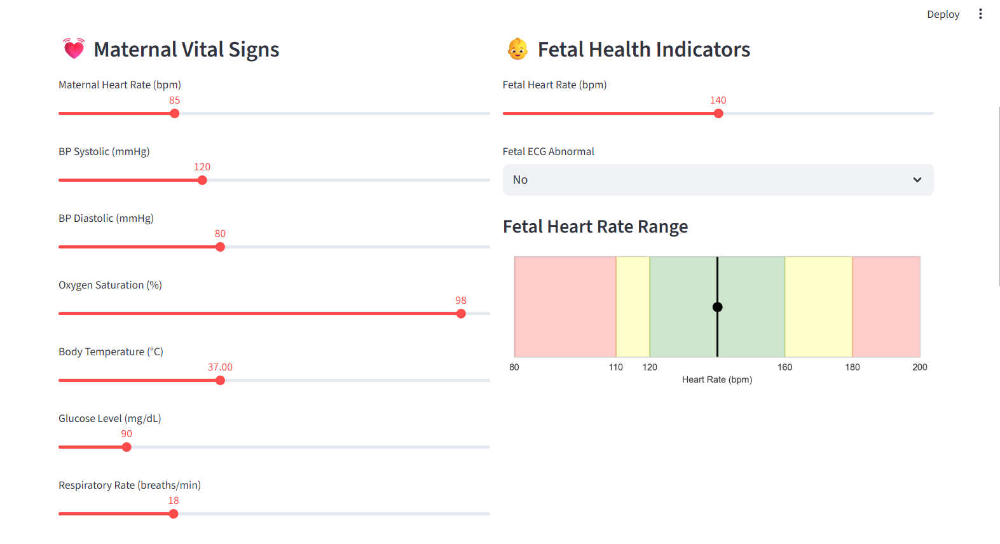
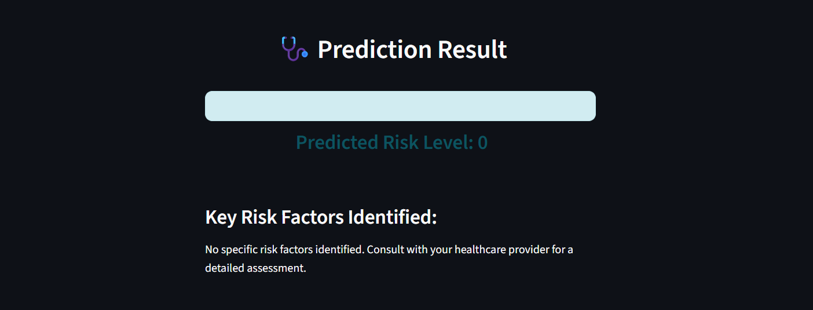

# 🤰 Pregnancy Risk Prediction System

A machine learning-based web application that predicts pregnancy risk level (Low, Medium, or High) using maternal and fetal health parameters.

Developed as a capstone project by Kartik Jane from Priyadarshini College of Engineering, Nagpur.

## 📌 Problem Statement
Early prediction of pregnancy-related complications is crucial for ensuring maternal and fetal health. Manual assessments are time-consuming and subjective. This project builds an intelligent ML-based system that automatically classifies pregnancy risk level based on medical data.

## 💡 Proposed Solution
This system takes 24 clinical input features related to the mother and fetus, and predicts the pregnancy risk level (Low, Medium, or High) using classification algorithms. The solution is deployed as an interactive web app using Streamlit.

## 🔧 Technologies Used
- Python
- Scikit-learn
- Pandas, NumPy
- imbalanced-learn (SMOTE)
- Joblib (Model Saving)
- Streamlit (Web App)

## 📊 Features Used
- Maternal Age, Blood Pressure, Heart Rate, Blood Sugar, Temperature
- Fetal Heart Rate, ECG, Movements, Position
- Pregnancy History (Multiple pregnancy, Preterm labor, etc.)
- Total: 24 features from maternal and fetal records

## 🧠 Machine Learning Models
Model | Accuracy | Notes
--- | --- | ---
Logistic Regression | 70.0% | Best pre-SMOTE
Random Forest + SMOTE | 44.0% | Better class-wise balance
Gradient Boosting | 58.0% | Balanced, slower training
SVM | 54.0% | Requires feature scaling
Naive Bayes | 50.0% | Fast but lower performance

Model selection was based on both accuracy and class-wise F1-score. Final deployment used Logistic Regression.

## 📁 Project Structure
```
PregnancyRiskPrediction/
├── app.py                     # Streamlit web application
├── main.py                    # Model training and evaluation runner
├── requirements.txt           # Python dependencies
├── data/
│   └── Maternal fetal data.xlsx  # Raw input dataset
├── models/
│   └── best_model.pkl            # Saved trained ML model
├── src/
│   ├── preprocessing.py          # Data preprocessing script
│   └── model.py                  # ML model training and evaluation
└── docs/
    └── screenshots/
        ├── prediction_result.svg # Output preview (generated)
        └── app_overview.svg      # UI preview (generated)
```

## 🚀 How to Run Locally

- Create and activate a virtual environment (Windows):
```
python -m venv .venv
.\.venv\Scripts\activate
```

- Install dependencies:
```
pip install -r requirements.txt
```

- Run the Streamlit app:
```
python -m streamlit run app.py
```

- Optional: Train models and save artifacts:
```
python main.py
```

## 🖼️ website Preview

- Predicted Risk Level container (light-blue):



- App overview:


##🖼️ Output Preview (output/)

These screenshots are stored in `output/` and illustrate the running app UI and prediction result.




## �📦 Update Repository (Start to End Commands)

- Initialize Git and first commit:
```
git init
git add .
git commit -m "Initial commit: pregnancy risk prediction app"
```

- Create main branch and set default:
```
git branch -M main
```

- Add remote and push (replace with your repo URL):
```
git remote add origin https://github.com/<your-username>/pregnancy-risk-prediction.git
git push -u origin main
```

- Typical update workflow:
```
# Make your changes
# Stage and commit
git add .
git commit -m "Update UI and README with output screenshots"

# Push to remote
git push
```

- Create a feature branch (recommended):
```
git checkout -b feature/ui-improvements
# make changes
git add .
git commit -m "Add light-blue prediction container and label mapping"
git push -u origin feature/ui-improvements
```

## 📚 Dataset
The dataset consists of anonymized maternal-fetal records with 24 clinical features (included in `/data/`).

## 🙋 Author
- Name: Kartik Wasudeo Jane
- College: Priyadarshini College of Engineering, Nagpur
- Email: kartikjane26@gmail.com
